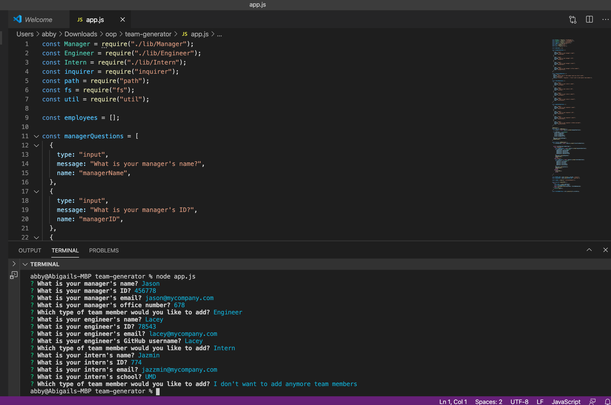

# Employee Generator

## Description

This application allows the user to generate an HTML webpage displaying their team's basic information through a Node CLI.




## User story

``` 
AS a manager
I want to generate a webpage that displays my team's basic info
SO that I have quick access to emails and GitHub profiles

```

## Table of Contents
            
* [Installation](#Installation)
* [Built With](#Usage) 


## Installation

If you'd like to get a copy of the project up and running on your local machine for development and testing purposes, follow the instructions below.

### Git clone the repository to your local machine:

 git clone https://github.com/ablizben/team-generator


### Install all dependencies:

    npm install

### Run the app:

    node index.js

## Built With

- [Node.js](https://nodejs.org/en/) - JavaScript Runtime Environment
- JavaScript, HTML, CSS

