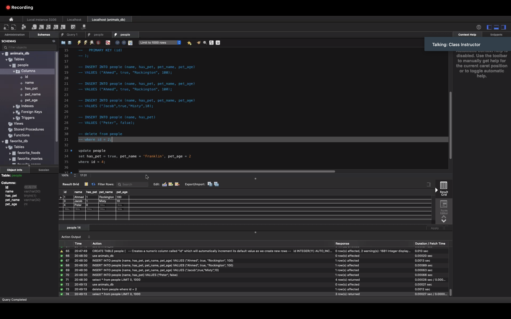
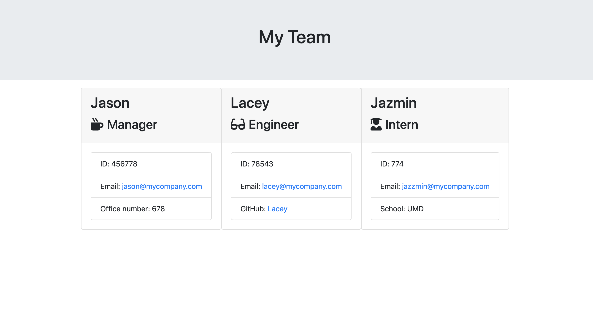

<h2>Unit 10 OOP Homework: Template Engine - Employee Summary</h2>
The purpose of this homework was to create a Node CLI that takes in information about employees and generates an HTML page displaying the information entered in.

<h3>Code Style</h3>
<ul>
  <li>HTML</li>
  <li>CSS</li>
  <li>JavaScript</li>
  <li>Node.js</li>
</ul>

<h3>Prerequisites</h3>
<ul>
  <li>Visual Studio Code</li>
  <li>GitHub Account</li>
  <li>NPM Inquirer Package</li>
</ul>

<h3>Team Generator Criteria</h3>
<li>As a user, I want to generate a webpage that displays my team's basic info,so that I have quick access to emails and GitHub profiles</li>

<h3><a href="https://drive.google.com/file/d/1os17imC0ey9oKD8D2kowcVwpN818ome_/view">Link to Demo</a></h3>
